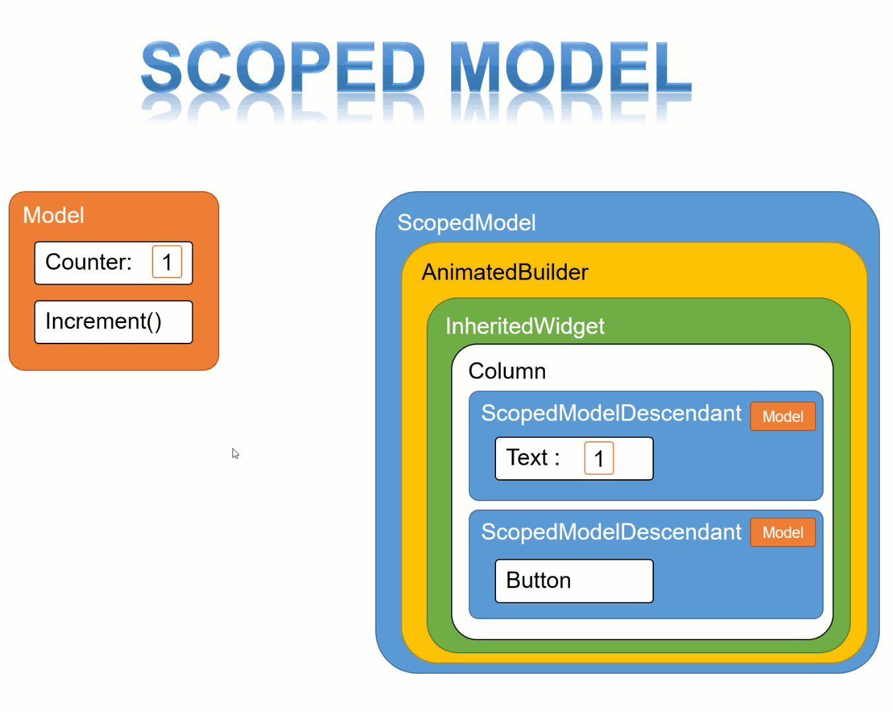
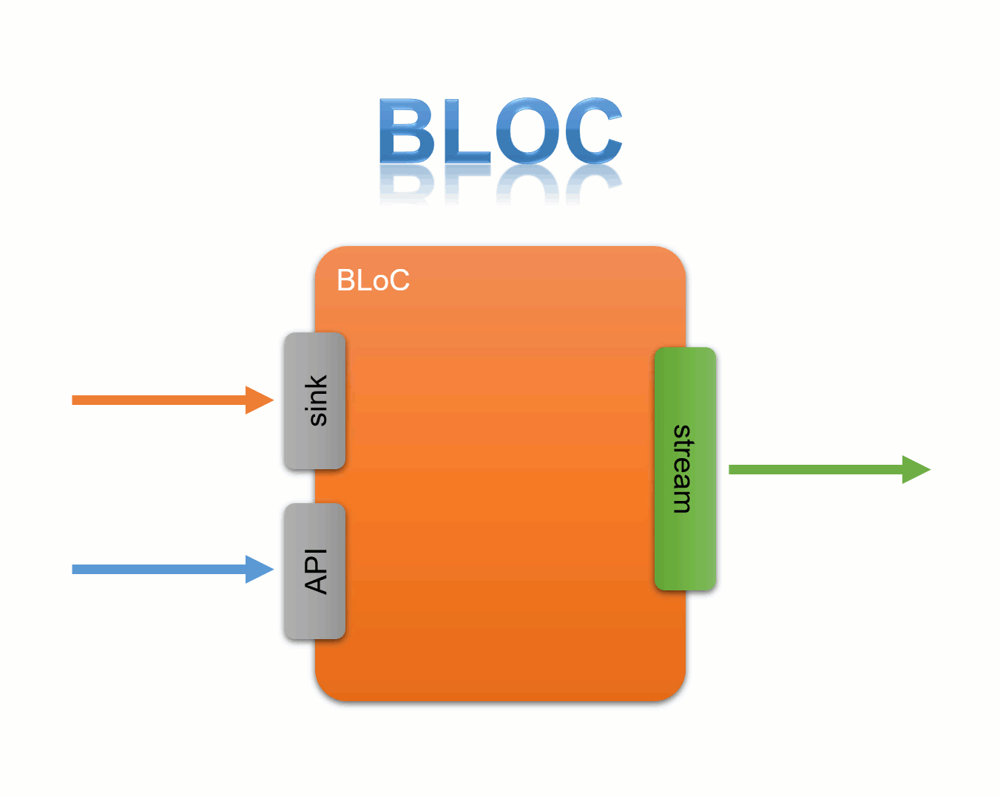

# flutter-overview

flutter-overview - Set/2019

# Arquitetura

## Widgets

Um Widget é um pedaço da tela, um conjunto de botões, um form ou mesmo um simples “Loading”. Para o Flutter, tudo são Widgets.

## Stateless Widgets 

são componentes que não mantém estado, ou seja, sempre que atualizarmos a tela, nada é armazenado.

## Statefull Widgets 

Retêm seu estado, e mesmo atualizando a tela, tudo permance intacto.

## SetState

Para atualizar as informações na tela, utilizamos o SetState, funciona como um refresh, refazer apenas as partes da tela que foram alteradas.

## State Management



## Provider

Singleton, garante que só teremos uma única instância de um determinado objeto na memória, garantido que ele seja utilizado em toda aplicação.

## BLoC

A arquitetura BLoC (Business Logic Component) permite uma separação da logica de negócio da sua aplicação e da UI através do uso de Streams.



## Run

### Devices

```
 flutter devices
 flutter run -d <emulator-xxx>
```

### Web

```
 flutter channel master
 flutter upgrade
 flutter config --enable-web
 cd <into project directory>
 flutter create .
 flutter run -d chrome
 
 https://flutter.dev/docs/get-started/web

```


